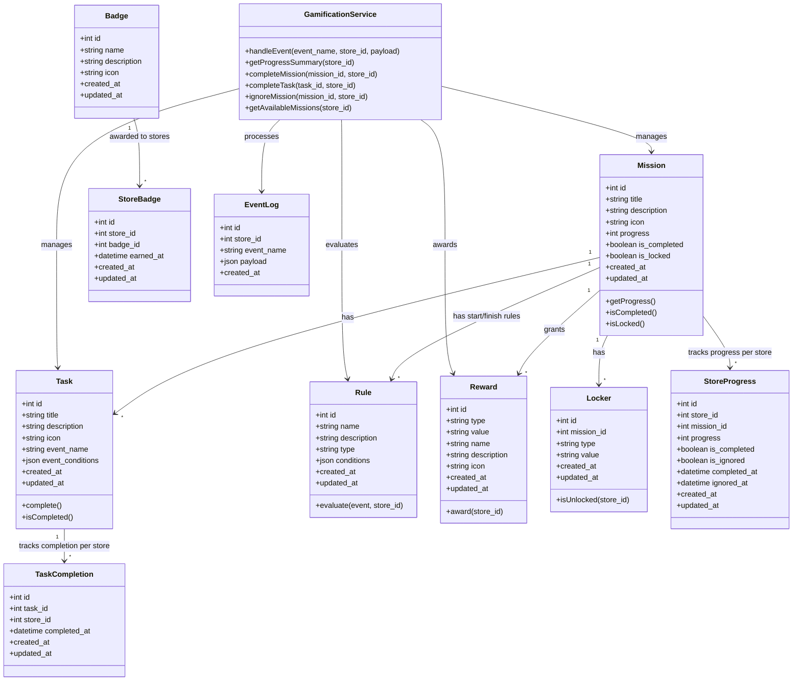

# Salla Gamification System - Class Diagram

The following diagram illustrates the class structure and relationships within the Salla Gamification System.

This class diagram represents the core entities and their relationships in the Salla Gamification System. The main entity is `Mission`, which contains multiple `Task` objects. Each `Mission` can have start and finish `Rule` objects that determine when the mission becomes available and when it's completed. `Reward` objects are granted upon mission completion, and `Locker` objects can keep missions locked until certain conditions are met. The system also tracks progress for each store (tenant) using the `StoreProgress` and `TaskCompletion` objects.