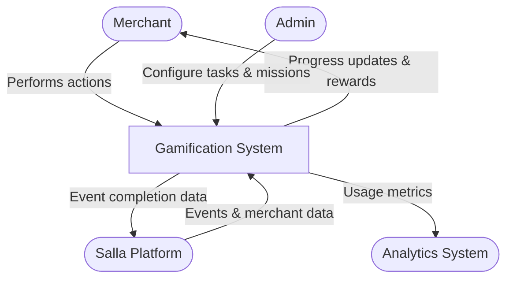
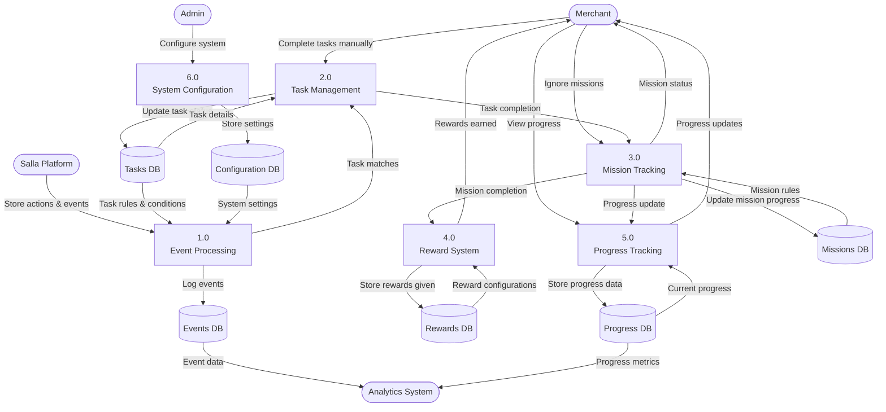

# Salla Gamification System - Data Flow Diagram

The following Data Flow Diagram (DFD) illustrates how data moves through the Salla Gamification System.

## Level 0 DFD (Context Diagram)

## Level 1 DFD

