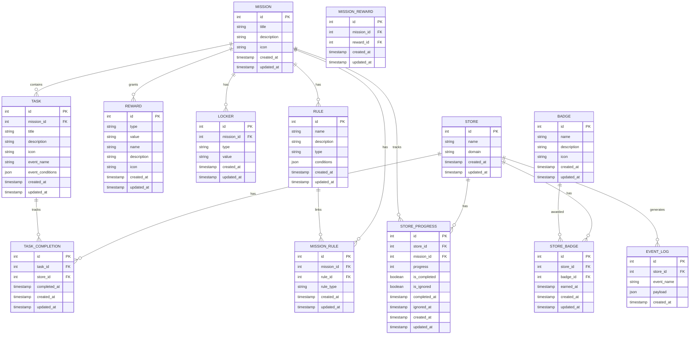

# Salla Gamification System - Entity Relationship Diagram

The following Entity-Relationship (ER) diagram illustrates the database structure of the Salla Gamification System.

The ER diagram above shows all entities in the Salla Gamification System and their relationships. The system is designed with a multi-tenant architecture, where each merchant (Store) has its own progress, task completions, and badges. The main entities include Mission, Task, Rule, Reward, and Badge. Join tables like MISSION_RULE and MISSION_REWARD enable many-to-many relationships between entities.