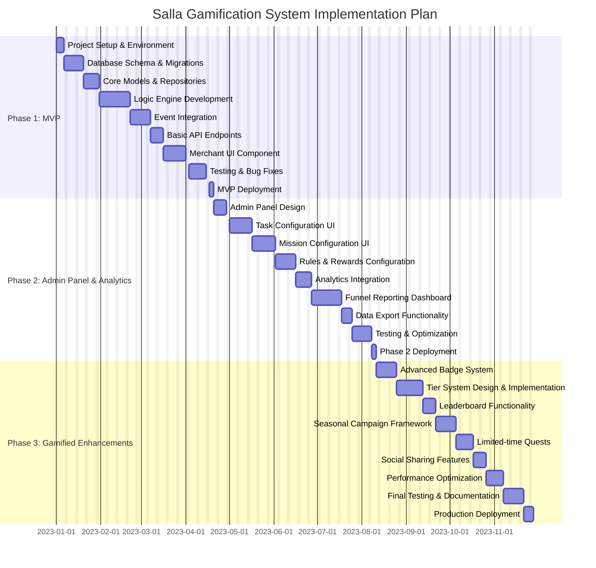

# Salla Gamification System - Implementation Gantt Chart

The following Gantt chart illustrates the implementation timeline for the Salla Gamification System across its three phases.

This Gantt chart outlines the implementation timeline for the three phases defined in the PRD:

1. **Phase 1: MVP** - Focuses on implementing the core logic engine, event integration, reward system, and the basic UI component for merchants.
2. **Phase 2: Admin Panel & Analytics** - Introduces admin configurations for tasks, missions, rules, and rewards, along with analytics dashboards for tracking merchant progress.
3. **Phase 3: Gamified Enhancements** - Adds advanced gamification features like badges, tiers, leaderboards, and seasonal campaigns to enhance merchant engagement.