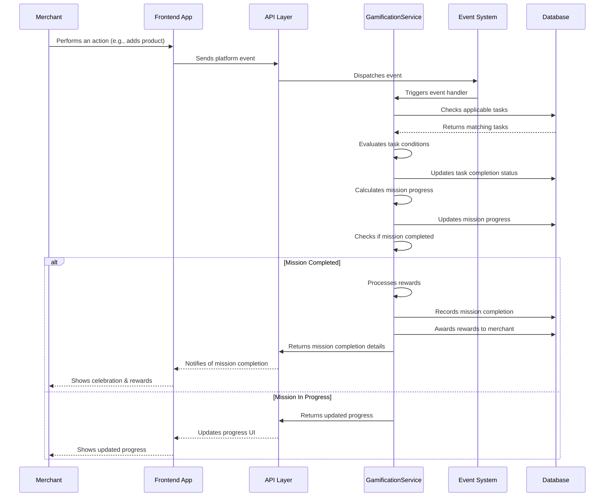
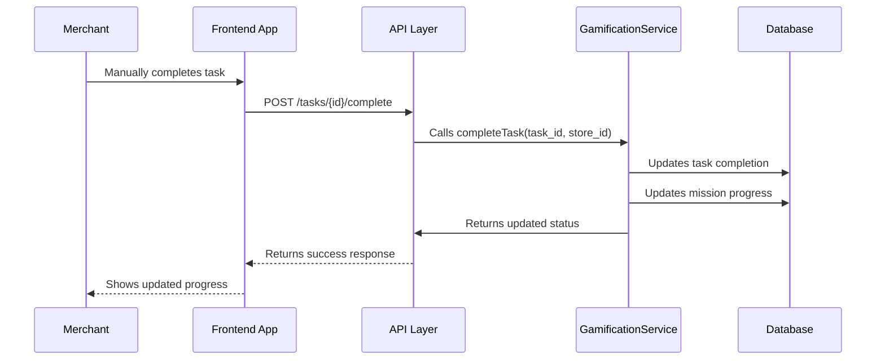
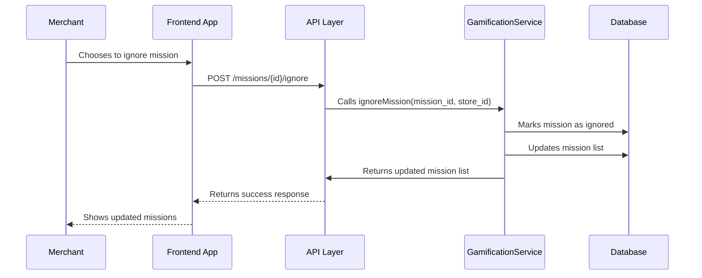

# Salla Gamification System - Sequence Diagram

The following sequence diagram illustrates the process of task completion and mission progression within the Salla Gamification System.

## Task Completion Flow

## Manual Task Completion

## Mission Ignore Flow

