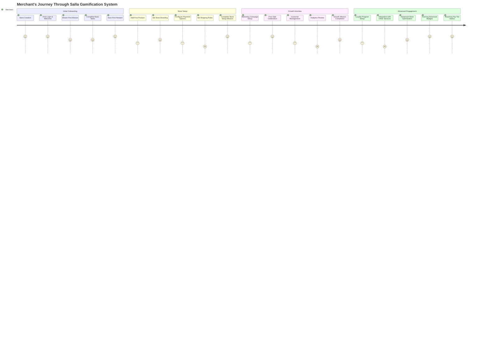

# Salla Gamification System - User Journey Diagram

The following diagram illustrates the journey of a merchant through the Salla Gamification System, from initial onboarding to advanced engagement.

This user journey diagram illustrates the emotional journey of a merchant through various stages of using the Salla platform with the Gamification System. The numbers (1-5) represent the satisfaction or engagement level at each step, with 5 being the highest level of engagement.

The journey is divided into four key sections:

1. **Initial Onboarding**: The merchant's first experience with the platform, featuring high engagement points at store creation and earning their first reward.

2. **Store Setup**: Core store configuration tasks that may have varying levels of engagement but culminate in a satisfying mission completion.

3. **Growth Activities**: Tasks focused on growing the merchant's business, with particularly high engagement around celebrating their first sale.

4. **Advanced Engagement**: Higher-level activities for established merchants, with peak engagement around earning badges and reaching top tier status in the gamification system.